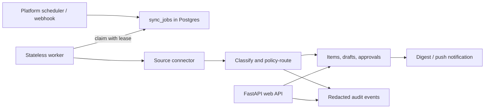

# Triage v2: Corrected Upgrade Plan

## Decision summary

The v2 direction is sound: keep a deterministic pipeline, automate collection and
triage, and retain explicit human approval for any consequential action. Do **not**
introduce a multi-agent planner.

The original v2 plan needs correction in four areas:

1. It understates what is already implemented: hosted Google accounts, encrypted
   Google credentials, PostgreSQL support, durable sessions, push subscriptions,
   and a scheduler-facing reminder endpoint already exist.
2. An APScheduler loop alone is not durable enough to be the production scheduler.
   Restarts and accidental multiple worker replicas can skip or duplicate work.
3. Timestamp-only source cursors and LLM self-reported confidence are not reliable
   enough for unattended processing.
4. Workspaces must be introduced before accumulating more hosted user data if the
   professional/org path remains a real product goal.

## Current baseline (the code, not the original plans)

- The backend is a single FastAPI service, with manual Gmail, Classroom, and
  WhatsApp-demo sync endpoints.
- There are two implemented runtime modes. The default local/demo mode uses a shared
  password, in-memory session tokens, SQLite, and local `token.json` Google OAuth.
  That is the mode in use unless hosted environment variables are configured.
- A separate, checked-in hosted mode already requires PostgreSQL, uses Google OAuth,
  encrypts credential and push-subscription payloads with Fernet, and scopes records
  by `owner_id`. Its presence in the repository does **not** prove that any deployed
  environment has supplied the required secrets or enabled it.
- The database has PostgreSQL schema initialization support, rather than a mature
  versioned migration framework, and has an owner/source-item uniqueness constraint.
  It does not yet have autonomous-run, source-cursor, workspace, or audit-event
  tables.
- The current classifier is a structured OpenAI call. Routine form/poll drafts are
  deterministic, copy-only helpers and still require approval.
- Durable deadline push code and an authenticated scheduler-facing dispatch endpoint
  are already present, but they become operational only when hosted auth, VAPID
  secrets, and an external scheduler are configured.

## Corrected architecture

Use one deterministic pipeline and one durable work model. A platform scheduler
creates due work; stateless worker processes claim it. The web API never performs a
full sync in the request path.



### Scheduling and job safety

- Prefer a Railway cron or equivalent external scheduler that invokes a `run once`
  worker command. APScheduler may be used only for local development or as a
  convenience to enqueue due jobs; it must not be the sole durability mechanism.
- Store a `sync_jobs` row per workspace/source/run with `queued`, `running`,
  `succeeded`, `failed`, and `cancelled` states; include an attempt count, lease
  expiry, and next-attempt time.
- Claim jobs transactionally using PostgreSQL row locking (`FOR UPDATE SKIP LOCKED`)
  or an equivalent lease. This makes retries and multiple worker replicas safe.
- Give each source connection an opaque provider checkpoint where available. For
  timestamp-based APIs, keep an overlap window and rely on idempotent dedupe. Do
  not use `fetch_new_items(since: datetime)` as the sole correctness boundary.
- Keep automatic retries bounded, exponential, and jittered. After five consecutive
  source failures, pause that source, surface the failure, and require the user to
  reconnect or resume it.

### Classification and approvals

- Extend the classification response with `review_required`, `review_reasons`, and
  `draft_eligible`; validate the schema strictly and reject malformed outputs.
- Do not use a model-generated numeric `confidence` as a production safety gate.
  It is not calibrated. Start with deterministic review rules (missing deadline,
  conflicting instructions, unfamiliar sender, unsafe action) and add model
  confidence only after evaluating it against a labeled corpus.
- Treat generated drafts as inert data. They may be prepared automatically, but
  cannot send, submit, fill an external form, or expose profile data without an
  explicit approval flow.
- Never load a browser-only form profile into a background job. If profile data is
  later stored server-side, make each field opt-in, encrypt it, label its purpose,
  and expose deletion/export controls.

### Audit and privacy

- Add an `audit_events` table, but make it append-only **and privacy-minimized**:
  event type, actor (`system` or user), item/job identifiers, outcome, timestamps,
  and redacted error codes. Do not duplicate full emails, attachments, credentials,
  or generated text into every audit row.
- Add a retention policy for raw source content, attachments, logs, expired OAuth
  states, and job history. The policy must be user-visible and have deletion paths.
- Keep the existing encrypted credential storage, but replace the single permanent
  Fernet-key assumption with a documented key rotation plan before public launch.
  A managed KMS is preferred when the chosen host supports it.

## Data-model changes

Introduce these migrations additively; never recreate or reset an existing database.

1. `workspaces` and `workspace_memberships`; create one personal workspace for every
   existing hosted user.
2. Add `workspace_id` to items, study plans, pending actions, source status,
   credentials/connections, notifications, and future jobs. Keep `owner_id` during
   migration only as a compatibility field, then retire it deliberately.
3. `source_connections` containing source, workspace, encrypted credential reference,
   enabled/paused state, provider cursor, selected channels, sync cadence, failure
   count, and last successful sync.
4. `sync_jobs` with an idempotency key, lease, retry fields, and structured outcome.
5. `audit_events` and `notification_deliveries` with the minimized event payloads
   described above.
6. Change the item dedupe key from the current `(owner_id, source_id)` shape to
   `(workspace_id, source, source_id)`. Source IDs are only guaranteed unique within
   a provider; including `source` prevents a cross-provider collision.

## Connector contract

Use a narrow connector protocol, but make the cursor and attachments explicit:

```python
class SourceConnector(Protocol):
    source_name: str

    def fetch_changes(self, connection: SourceConnection, cursor: str | None) -> FetchResult:
        """Return normalized items and the next opaque cursor without committing it."""

    def validate_connection(self, connection: SourceConnection) -> ConnectionHealth:
        """Perform a lightweight permission and token-health check."""
```

The worker writes items, audit events, and the next cursor in one transaction where
possible. If provider paging cannot be wrapped in one transaction, it persists
per-page idempotency keys before advancing the cursor.

## Source rollout corrections

### Gmail and Classroom first

Move the existing Gmail/Classroom sync logic behind the connector boundary without
changing its behavior. Prove background ingestion, duplicate handling, leases,
pause/resume, and per-workspace isolation before adding a new provider.

### Slack second

Use Slack Events API for new events, but the webhook must verify Slack signatures,
persist an idempotent event envelope, and acknowledge quickly. It must **not** wait
for classification or enqueue work only in memory; Slack retries requests that do
not receive a timely successful response. Restrict ingestion to channels a user has
explicitly selected and the app is invited to. Use periodic reconciliation to cover
missed events. See [Slack's Events API guidance](https://api.slack.com/apis/connections/events-api).

### Teams later, with webhooks evaluated first

Do not assume Teams must poll. Microsoft Graph supports channel-message change
notifications, including delegated `ChannelMessage.Read.All` at the channel level.
Subscriptions expire and need renewal; support, consent, and licensing vary by
resource. Start with selected channels and Graph notifications plus a reconciliation
poller. Treat tenant-wide application permissions as an enterprise-only choice that
requires admin consent and a separate security review. See [Microsoft's Teams
message subscription documentation](https://learn.microsoft.com/en-us/graph/teams-changenotifications-chatmessage).

## Revised delivery phases

### Phase 0 — Evidence and guardrails

- Create a versioned, labeled evaluation set from consented/sanitized messages.
- Define false-negative and false-positive thresholds for obligations, plus review
  rules and failure alerts.
- Add environment separation, secrets inventory, key-rotation procedure, retention
  policy, and an incident/runbook checklist.

### Phase 1 — Hosted foundation

- Add personal workspaces and memberships now, before new data flows accumulate.
- Add additive PostgreSQL migrations, source connections, cursor state, job leases,
  audit events, and kill switch.
- Convert Gmail and Classroom to the connector contract.

**Exit gate:** two workers can run safely without duplicate items; a restart resumes
jobs; pausing a source stops its jobs; the user can inspect every automated outcome.

### Phase 2 — Autonomous Google ingestion

- Enqueue scheduled Gmail/Classroom syncs and run them with stateless workers.
- Add bounded retries, source circuit breakers, digest notifications, and cost
  accounting based on recorded model usage rather than a rough estimate.

**Exit gate:** a staged failure, retry, expired token, duplicate source item, and
low-confidence/ambiguous message all produce the expected visible state.

### Phase 3 — Slack pilot

- Implement signed webhook ingestion, durable event envelopes, channel selection,
  reconciliation, and the same audit/approval behaviors.
- Pilot with a small number of explicitly consenting workspaces before general use.

### Phase 4 — Teams pilot and professional defaults

- Implement selected-channel Microsoft Graph subscriptions, renewal, and
  reconciliation; add a polling fallback only for unsupported scenarios.
- User-test a professional taxonomy before adding categories. Do not reuse `Study
  Material` blindly; likely candidates are `Action`, `Reference`, `FYI`, and
  `Needs Review`.

### Phase 5 — Organization features

- Add invitations, admin roles, member visibility rules, and organization-wide
  dashboards only after a tenancy/isolation review and tests for every workspace
  boundary.

## Explicit non-goals for v2

- No autonomous external sending, form submission, polling, or calendar changes.
- No general-purpose planner, agent-to-agent negotiation, or arbitrary tool use.
- No tenant-wide Slack/Teams collection by default.
- No migration that recreates, resets, or overwrites an existing local database.
